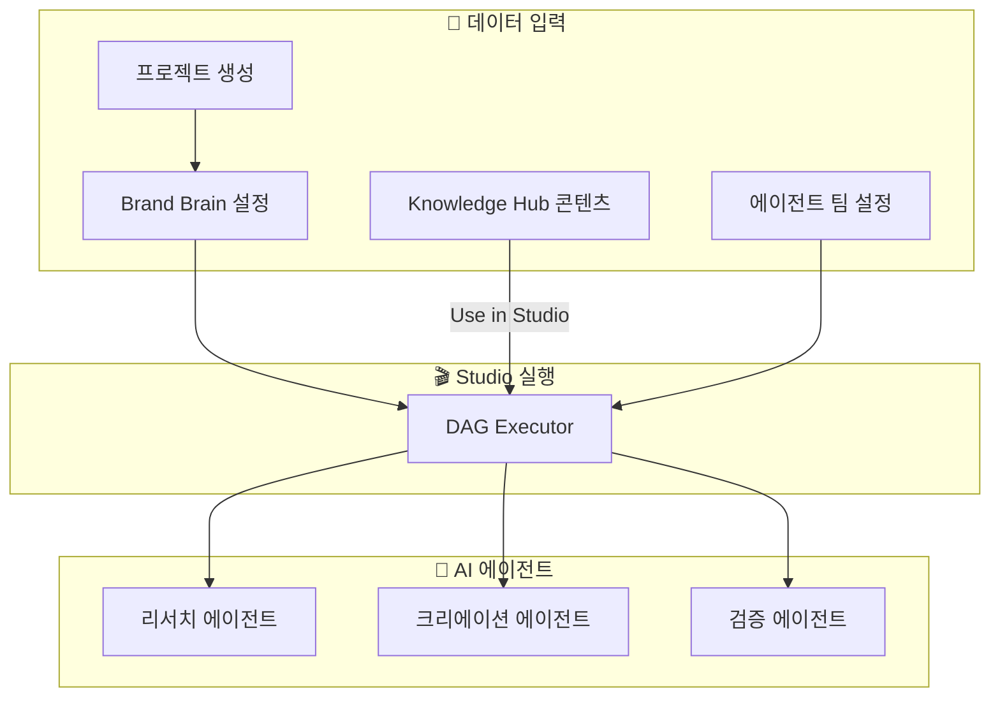
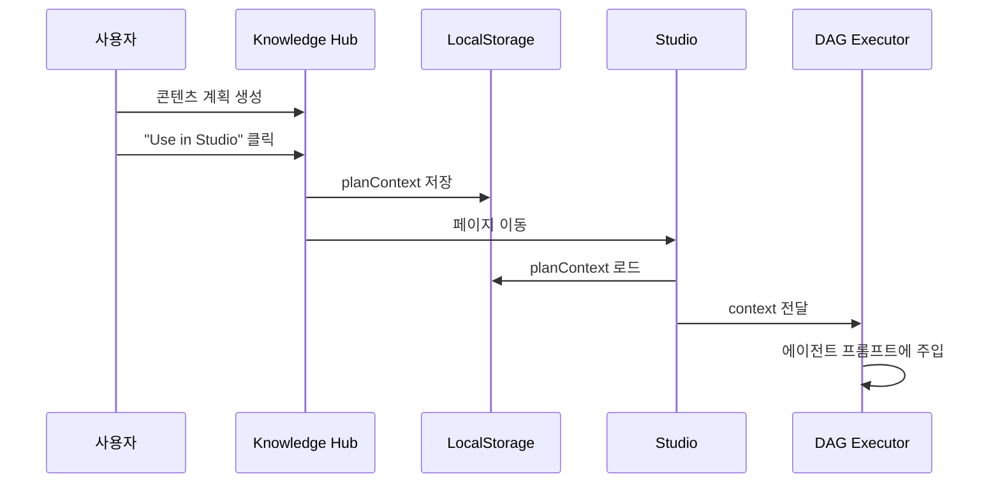
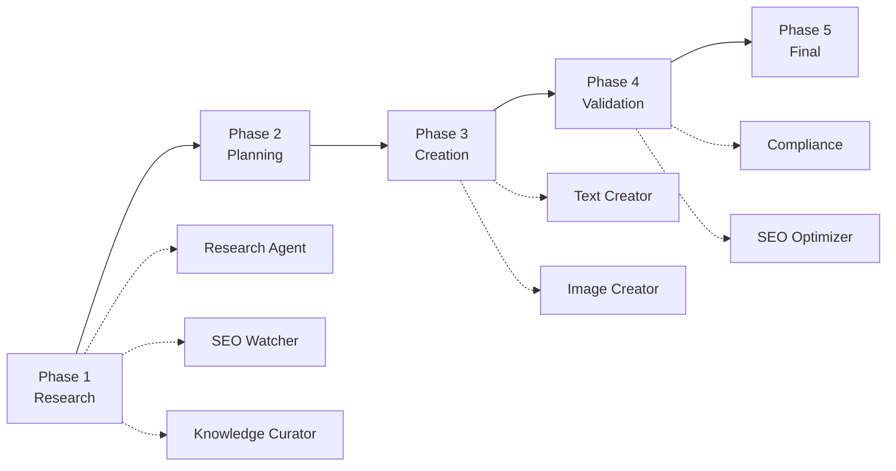
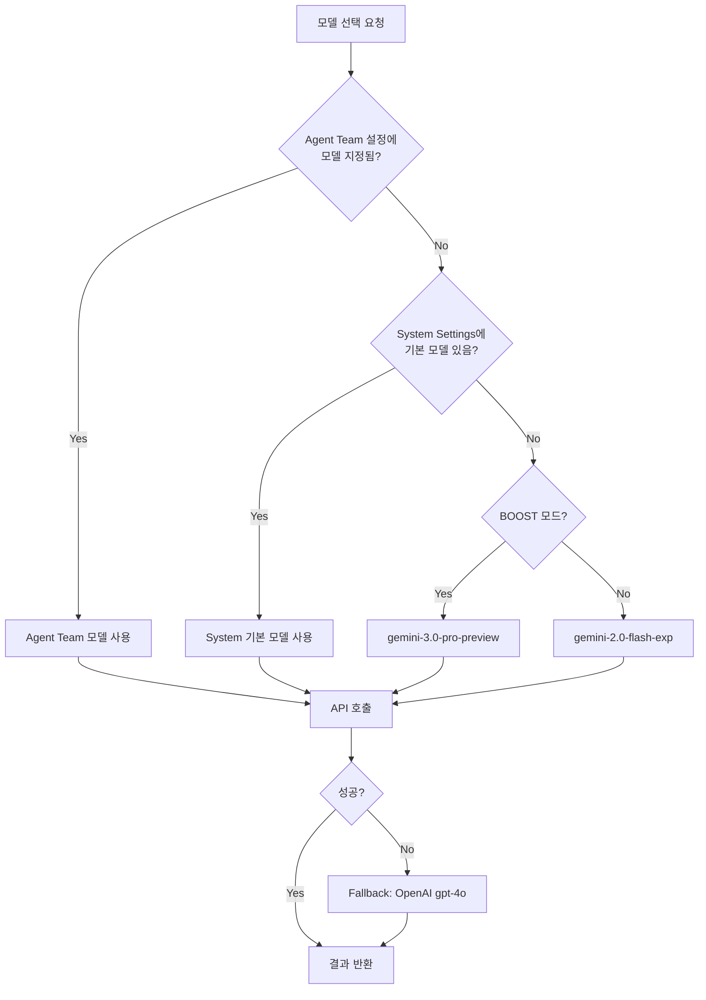
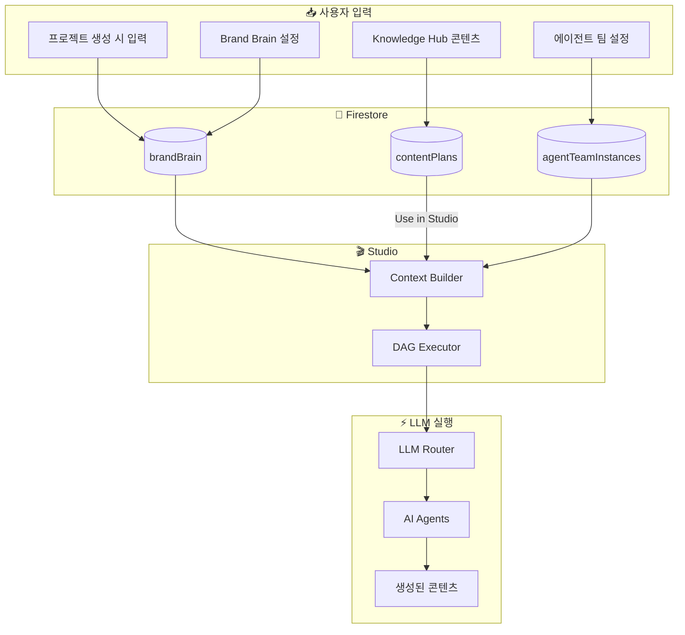

# ZYNK 에이전트 컨텍스트 흐름 & LLM 오케스트레이션
> 내부 교육자료 v1.0

## 개요

ZYNK 플랫폼은 고객의 프로젝트 정보, 브랜드 아이덴티티, 지식 베이스를 기반으로 최적화된 콘텐츠를 자동 생성합니다. 이 문서는 **고객 데이터가 어떻게 AI 에이전트들에게 전달**되고, **LLM 모델이 어떻게 오케스트레이션**되는지 설명합니다.

---

## 1. 데이터 소스 개요

ZYNK에서 콘텐츠 생성에 사용되는 4가지 주요 데이터 소스:

| 소스 | 설명 | 저장 위치 |
|------|------|----------|
| **Core Identity** | 프로젝트 기본 정보 (이름, 설명, 타겟 오디언스) | `projects/{id}/brandBrain` |
| **Brand Brain** | 브랜드 페르소나, 목소리, 웹사이트 분석 | `projects/{id}/brandBrain` |
| **Knowledge Hub** | 콘텐츠 계획, 소스 문서, 요약 정보 | `projects/{id}/contentPlans` |
| **Agent Team Settings** | 팀 목표, 서브에이전트 시스템 프롬프트 | `projectAgentTeamInstances/{id}` |



---

## 2. Core Identity (프로젝트 기초정보)

### 2.1 Core Identity란?

프로젝트 생성 시 입력하는 **기본 정보**로, 모든 콘텐츠 생성의 기반이 됩니다.

### 2.2 포함 정보

| 필드명 | 설명 | 예시 |
|--------|------|------|
| `projectName` | 프로젝트/브랜드 이름 | "Vision Chain" |
| `description` | 프로젝트 설명 | "블록체인 기반 엔터프라이즈 솔루션" |
| `targetAudience` | 타겟 고객층 | "기업 의사결정자, 기술 투자자" |
| `industry` | 산업 분야 | "Blockchain / Web3" |
| `brandVoice` | 브랜드 목소리 톤 | "Professional, Innovative, Trustworthy" |

### 2.3 데이터 저장 및 로드

**저장 위치:**
```
Firestore → projects/{projectId}/brandBrain (문서)
```

**Brand Brain UI에서 로드:**
```javascript
// brand-brain.js
const brandBrainDoc = await db.collection('projects')
    .doc(projectId)
    .collection('brandBrain')
    .doc('main').get();

const ci = brandBrainDoc.data().coreIdentity;
// ci.projectName, ci.description, ci.targetAudience 등 사용
```

### 2.4 Studio로 전달 과정

1. 사용자가 **Studio에서 프로젝트 선택**
2. DAG Executor가 **해당 프로젝트의 brandBrain 문서 조회**
3. Core Identity 정보를 **각 에이전트의 시스템 프롬프트에 주입**

---

## 3. Knowledge Hub → Studio 연동

### 3.1 "Use in Studio" 버튼 기능

Knowledge Hub에서 생성한 콘텐츠 계획을 **Studio로 직접 전달**하는 기능입니다.

### 3.2 동작 흐름



### 3.3 구현 코드

**Knowledge Hub에서 저장 (knowledgeHub.js):**
```javascript
function usePlanInStudio(plan) {
    const planContext = {
        title: plan.title,           // "AI 트렌드 트위터 스레드"
        content: plan.content,       // 상세 계획 내용
        theme: plan.theme,           // "Technology Innovation"
        format: plan.format,         // "Twitter Thread (6 Tweets)"
        goal: plan.goal              // "Position as thought leader"
    };
    
    localStorage.setItem('studioContext', JSON.stringify(planContext));
    window.location.href = '/studio/';
}
```

**Studio에서 로드 (studio.js):**
```javascript
// 페이지 로드 시 확인
const storedContext = localStorage.getItem('studioContext');
if (storedContext) {
    state.planContext = JSON.parse(storedContext);
    localStorage.removeItem('studioContext'); // 1회성 사용
    
    // UI에 표시
    showNotification(`📋 Plan loaded: ${state.planContext.title}`);
}
```

### 3.4 planContext 활용

DAG Executor 실행 시:
```javascript
executor.start(
    selectedAgents,
    state.selectedProject,
    state.selectedAgentTeam,
    state.planContext,  // ← Knowledge Hub에서 전달받은 컨텍스트
    state.isBoostMode ? 'BOOST' : null
);
```

---

## 4. Agent Team Settings (에이전트 팀 설정)

### 4.1 Agent Team Settings란?

Mission Control에서 설정하는 **에이전트 팀의 목표와 각 서브에이전트의 동작 방식**입니다.

### 4.2 설정 항목

| 항목 | 설명 |
|------|------|
| **Team Name** | 에이전트 팀 이름 (예: "Vision Chain X Marketing Team") |
| **Team Goal (Directive)** | 팀 전체의 활성 목표 |
| **Sub-Agent System Prompts** | 각 에이전트별 행동 지침 |

### 4.3 데이터 구조

```
Firestore 구조:
projectAgentTeamInstances/{teamId}
├── name: "Vision Chain X Marketing Team"
├── directive: "Vision Chain을 안전하고 규제 친화적인 블록체인으로 포지셔닝..."
├── channel: "x" (Twitter)
└── subAgents/ (컬렉션)
    ├── planner_agent
    │   ├── displayName: "콘텐츠기획설계 Agent"
    │   └── systemPrompt: "당신은 콘텐츠 전략 전문가입니다..."
    ├── creator_text
    │   ├── displayName: "텍스트생성 에이전트"
    │   └── systemPrompt: "당신은 소셜 미디어 카피라이터입니다..."
    └── ...
```

### 4.4 Studio에서 Team Settings 접근

**UI 접근 방법:**
1. Studio 좌측 패널 → **Agent Roster** 옆 ⚙️ 아이콘 클릭
2. **Team Brain Settings** 모달 표시
3. Team Goal과 각 Sub-Agent 설정 확인 가능

**적용 버튼:**
```javascript
window.applyTeamSettings = function() {
    if (window.dagExecutor) {
        window.dagExecutor.setTeamContext(state.teamSettings);
        // 이제 모든 에이전트가 이 설정을 참조
    }
};
```

---

## 5. DAG Executor - 실행 엔진

### 5.1 DAG Executor란?

**Directed Acyclic Graph (방향성 비순환 그래프)** 기반의 워크플로우 실행 엔진입니다.
여러 에이전트를 **단계별로 순차/병렬 실행**합니다.

### 5.2 실행 단계 (Phases)



### 5.3 컨텍스트 주입 방식

DAG Executor가 각 에이전트에 전달하는 정보:

```javascript
const agentConfig = {
    // 1. 시스템 프롬프트 (Team Settings에서)
    systemPrompt: this.getSubAgentPrompt('planner') || defaultPrompt,
    
    // 2. 태스크 프롬프트 (모든 컨텍스트 통합)
    taskPrompt: `
        📋 팀 목표: ${this.getTeamDirective()}
        
        📄 콘텐츠 계획:
        ${context.planContext?.content || '계획 없음'}
        
        🎯 타겟 오디언스: ${projectData.targetAudience}
        
        위 정보를 바탕으로 최적화된 콘텐츠를 생성하세요.
    `,
    
    // 3. 모델 설정
    model: 'gemini-3.0-pro-preview',
    temperature: 0.7
};
```

---

## 6. LLM 오케스트레이션

### 6.1 모델 라우팅 시스템

ZYNK는 **품질 티어(Quality Tier)**에 따라 다른 LLM 모델을 사용합니다.

| 티어 | 모델 | 설명 |
|------|------|------|
| **BOOST** (유료) | `gemini-3.0-pro-preview` | 최고 품질, 복잡한 작업 |
| **DEFAULT** | `gemini-2.0-flash-exp` | 표준 품질, 빠른 속도 |
| **Fallback** | `gpt-4o` (OpenAI) | 구글 API 실패 시 대체 |

### 6.2 모델 선택 우선순위



### 6.3 Fallback 메커니즘

```javascript
// functions/index.js
try {
    // 1차: 선택된 모델로 시도
    result = await callLLM(provider, model, messages);
} catch (error) {
    // 2차: Fallback 실행
    console.warn('⚠️ Auto-Failover to OpenAI...');
    
    const fallbackModel = (qualityTier === 'BOOST') 
        ? 'gemini-3.0-pro-preview' 
        : 'gemini-2.0-flash-exp';
    
    result = await callLLM('google', fallbackModel, messages);
}
```

---

## 7. 전체 데이터 플로우 요약



---

## 8. 핵심 요약

| 단계 | 설명 |
|------|------|
| **1. 데이터 수집** | Core Identity, Knowledge Hub, Team Settings에서 정보 수집 |
| **2. 컨텍스트 구성** | DAG Executor가 모든 정보를 통합하여 컨텍스트 생성 |
| **3. 에이전트 주입** | 각 에이전트의 시스템/태스크 프롬프트에 컨텍스트 주입 |
| **4. LLM 라우팅** | Quality Tier에 따라 최적 모델 선택 (BOOST/DEFAULT) |
| **5. 콘텐츠 생성** | 에이전트가 주입된 정보 기반으로 최적화된 콘텐츠 생성 |
| **6. 검증 & 출력** | Compliance, SEO 검증 후 최종 콘텐츠 출력 |

---

## 9. 주요 소스 파일

| 기능 | 파일 경로 |
|------|----------|
| Core Identity / Brand Brain | `brand-brain.js` |
| Knowledge Hub | `knowledgeHub.js` |
| Studio 메인 로직 | `studio/studio.js` |
| DAG 실행 엔진 | `studio/dag-executor.js` |
| LLM 라우팅 (Cloud Functions) | `functions/index.js` |
| Team Settings 핸들러 | `project-detail-card-handlers.js` |
