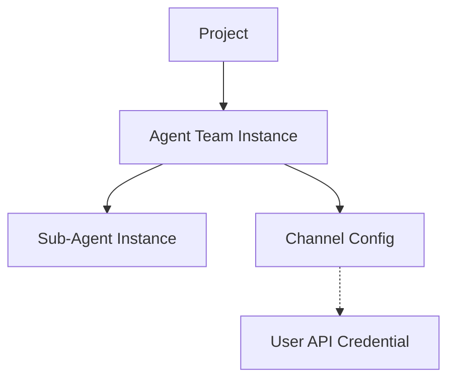

# Agent Team Data Architecture (v2)

## Overview
This document outlines the data architecture for Agent Teams, specifically focusing on the Channel Orchestrator v2 implementation (PRD 11.0 Phase 3).

## Data Models

### 1. Project Agent Team Instance (`projectAgentTeamInstances`)
Represents a deployed instance of an Agent Team within a project.

```typescript
interface ProjectAgentTeamInstance {
  id: string;
  projectId: string;
  name: string;
  description?: string;
  status: 'active' | 'archived' | 'error';
  
  // Channel Orchestrator v2
  channels: ChannelConfig[];
  
  // Legacy fields (Deprecated)
  channelId?: string;
  platform?: string;
  
  deployedAt: Timestamp;
  deployedBy: string; // userId
  updatedAt: Timestamp;
}
```

### 2. Channel Configuration (`ChannelConfig`)
Defines the configuration for a specific channel within a team.

```typescript
interface ChannelConfig {
  provider: 'instagram' | 'x' | 'youtube' | 'tiktok' | 'linkedin';
  credentialId: string | null; // Reference to userApiCredentials document ID
  workflowTemplateId?: string | null; // Future use
  
  enabled: boolean;
  status: ChannelStatus;
  lastErrorMessage?: string | null;
  updatedAt: Timestamp;
}
```

### 3. Channel Status (`ChannelStatus`)
The operational status of a channel connection.

| Status | Description | Visual Indicator |
| :--- | :--- | :--- |
| `ready` | API Key is configured and no errors reported. | 🟢 Green Dot / ✅ |
| `missing_key` | Channel is enabled but API Key is missing. | 🟡 Yellow Dot / ⚠️ |
| `error` | An error occurred (e.g., API auth failed). See `lastErrorMessage`. | 🔴 Red Dot / ⛔ |

## Relationships



## UI Representation

### Mission Control
- **Agent Team Card**: Displays icons for all enabled channels.
  - Each icon has a status indicator dot (Green/Yellow/Red).
  - **Readiness Badge**:
    - `Ready`: All enabled channels are `ready`.
    - `Needs Setup`: At least one channel is `missing_key` or `error`.

### Agent Detail Panel (View History)
- **Channel Connections Section**: Lists all configured channels.
  - Shows Provider Icon & Name.
  - Shows Status Badge (Ready/Missing Key/Error).
  - Shows linked Credential Label (fetched from `userApiCredentials`).
  - Shows Last Updated timestamp.
  - Displays error message if status is `error`.

## Migration & Normalization
- Legacy data (`channelId`, `platform`) is normalized on-the-fly using `ChannelOrchestrator.normalizeAgentTeamChannels()`.
- New deployments use the `channels` array structure directly.
