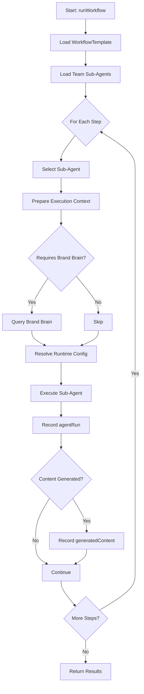

# Local Task Orchestrator V2

This document describes the Local Task Orchestrator, which executes WorkflowTemplates at the Agent Team level.

## Architecture Overview

The Local Task Orchestrator is responsible for:
1. Loading a WorkflowTemplate
2. Executing steps sequentially
3. Selecting appropriate Sub-Agents for each step
4. Integrating with Brand Brain and Runtime Resolver
5. Recording execution data in `agentRuns` and `generatedContents`

## Core Function: `runWorkflow`

### Signature
```javascript
async function runWorkflow({
  projectId: string,
  teamInstanceId: string,
  workflowTemplateId: string,
  taskContext: {
    prompt: string,
    channelId?: string
  }
}): Promise<WorkflowResult>
```

### Execution Flow



## Sub-Agent Selection Logic

The orchestrator selects a Sub-Agent for each workflow step using the following strategy:

1. **Exact Engine Type Match**: Find a sub-agent with `role_type` matching `step.engineType`
2. **Family Match** (Future): Match based on role family if engine type not found
3. **Fallback**: Use the first active sub-agent

```javascript
function selectSubAgentForStep(step, subAgents) {
  // 1. Exact match
  let candidate = subAgents.find(sa => sa.role_type === step.engineType);
  if (candidate) return candidate;
  
  // 2. Family match (TODO)
  // ...
  
  // 3. Fallback
  return subAgents.find(sa => sa.status === 'active');
}
```

## Execution Context Preparation

For each step, the orchestrator prepares an execution context that includes:

### Brand Brain Integration
```javascript
if (template.requiresBrandBrain) {
  const brandContexts = await queryBrandBrain(projectId, taskPrompt, {
    mode: template.brandContextMode || 'light'
  });
  context.brandContext = brandContexts;
}
```

### Runtime Configuration
```javascript
if (template) {
  context.runtimeConfig = await resolveRuntimeConfig(template, subAgent);
}
```

### Previous Step Outputs
```javascript
context.previousOutputs = previousResults.map(r => r.output);
```

## Data Recording

### AgentRun Recording
```javascript
{
  id: runId,
  project_id: projectId,
  team_instance_id: teamInstanceId,
  sub_agent_instance_id: subAgentInstanceId,
  
  // Workflow Linking
  workflowTemplateId,
  workflowStepId,
  teamInstanceId,
  
  status: 'completed',
  input_prompt: executionContext.taskPrompt,
  output_response: agentOutput.response,
  
  tokens_used: 0,
  execution_time_ms: duration,
  cost_estimated: 0,
  
  created_at: Timestamp.now(),
  completed_at: Timestamp.now()
}
```

### GeneratedContent Recording
```javascript
{
  id: contentId,
  project_id: projectId,
  team_instance_id: teamInstanceId,
  run_id: runId,
  
  // Workflow Linking
  workflowTemplateId,
  workflowStepId,
  teamInstanceId,
  channelId,
  
  content_type: content.type,
  content_body: content.body,
  status: 'draft',
  
  created_at: Timestamp.now(),
  updated_at: Timestamp.now()
}
```

## Testing

Use `test-workflow-orchestrator.html` to test the orchestrator:

1. Open the test page in a browser
2. Configure:
   - Project ID
   - Team Instance ID
   - Workflow Template ID
   - Task Prompt
   - Channel ID (optional)
3. Click "Run Workflow"
4. Monitor execution logs

## Current Limitations (Phase 2 - Step 7)

1. **Mock LLM Execution**: Sub-agent execution returns mock data instead of calling actual LLMs
2. **Mock Workflow Templates**: Templates are hardcoded, not loaded from Firestore
3. **Simple Sub-Agent Selection**: Only uses exact engine type matching
4. **No Error Recovery**: Failed steps stop the workflow immediately
5. **Sequential Only**: Steps execute one at a time (no parallel execution)

## Future Enhancements

1. **Actual LLM Integration**: Replace mock execution with real LLM calls
2. **Workflow Template Storage**: Store and load templates from Firestore
3. **Advanced Selection**: Use role families and capabilities for sub-agent selection
4. **Error Handling**: Retry logic, fallback strategies, partial completion
5. **Parallel Execution**: Execute independent steps in parallel
6. **Global Orchestrator**: Higher-level orchestrator to manage multiple workflows across channels
