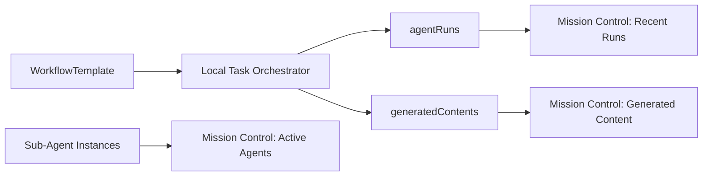

# Mission Control Orchestrator Integration V1

This document describes how the Mission Control UI integrates with the Workflow Orchestrator to display execution data.

## Overview

Mission Control uses a 3-panel layout to visualize Agent Team activity:
1. **Left Panel**: Active Sub-Agents
2. **Center Panel**: Recent Runs
3. **Right Panel**: Generated Content

With Phase 2 integration, each panel now displays workflow/step/channel information to provide full traceability.

## Data Flow



## Panel 1: Active Sub-Agents (Left)

### Data Source
- `projectAgentTeamInstances/{teamId}/subAgents`

### Display
- Sub-Agent name, role, status
- Metrics (success rate, total runs)
- Likes and ratings

### Phase 2 Enhancement
- **Filtering**: Click a sub-agent to filter Recent Runs by that agent
- Shows which workflows/steps this agent participated in

## Panel 2: Recent Runs (Center)

### Data Source
- `projects/{projectId}/agentRuns`
- Filtered by `team_instance_id`

### Display (Phase 2)
Each run card shows:
- **Status**: Success/Failed/Running
- **Prompt**: Task description
- **Agent**: Sub-agent that executed
- **Duration**: Execution time
- **Workflow Badge** (🔄): If `workflowTemplateId` exists
  - Example: "🔄 IG Organic"
- **Step Badge**: If `workflowStepId` exists
  - Example: "Planning", "Create Caption"

### Code Example
```javascript
const workflowBadge = run.workflowTemplateId ? 
    `<span class="workflow-badge">
        🔄 ${getWorkflowLabel(run.workflowTemplateId)}
    </span>` : '';
```

## Panel 3: Generated Content (Right)

### Data Source
- `projects/{projectId}/generatedContents`
- Filtered by `team_instance_id` or `run_id`

### Display (Phase 2)
Each content card shows:
- **Platform**: Instagram, X, Blog, etc.
- **Status**: Draft/Approved/Published
- **Preview**: Title, text, image
- **Workflow Badge** (🔄): Workflow template name
- **Step Badge**: Step that generated this content
- **Channel Badge** (📷): Target channel
  - Example: "📷 Instagram Main"

### Code Example
```javascript
const channelBadge = content.channelId ?
    `<span class="channel-badge">
        ${getChannelIcon(content.channelId)} ${getChannelLabel(content.channelId)}
    </span>` : '';
```

## User Flow: Tracing Execution

### Scenario: User wants to understand how a specific post was created

1. **Start**: User sees a post in Generated Content panel
2. **Workflow Context**: Sees "🔄 IG Organic" badge → knows it came from Instagram Organic workflow
3. **Step Context**: Sees "Create Caption" badge → knows it was generated in the copywriting step
4. **Channel Context**: Sees "📷 Instagram Main" → knows target channel
5. **Find Run**: Click the content → filters Recent Runs to show the specific run
6. **Find Agent**: See which sub-agent executed (e.g., "Copywriter")
7. **View Details**: Click run to see full prompt, response, and metrics

## Helper Functions

### Workflow Label Resolution
```javascript
function getWorkflowLabel(workflowTemplateId) {
    const labels = {
        'wf_tpl_ig_organic_post': 'IG Organic',
        'wf_tpl_x_thread': 'X Thread'
    };
    return labels[workflowTemplateId] || workflowTemplateId.replace('wf_tpl_', '');
}
```

### Step Label Extraction
```javascript
function getStepLabel(workflowStepId) {
    // step_001_planning -> "Planning"
    const match = workflowStepId.match(/step_\d+_(.+)/);
    return match ? match[1].replace(/_/g, ' ').toUpperCase() : workflowStepId;
}
```

### Channel Icon/Label
```javascript
function getChannelIcon(channelId) {
    if (channelId.includes('instagram')) return '📷';
    if (channelId.includes('x')) return '🐦';
    // ...
}
```

## CSS Styling

Workflow badges use distinct colors:
- **Workflow Badge**: Purple (`#a78bfa`)
- **Step Badge**: Green (`#4ade80`)
- **Channel Badge**: Blue (`#60a5fa`)

## Future Enhancements

1. **Workflow Timeline View**: Visualize all steps in a workflow execution
2. **Performance Analytics**: Compare workflow success rates
3. **Step-Level Filtering**: Filter runs by specific workflow step
4. **Channel Performance**: Compare content performance by channel
5. **A/B Testing UI**: Compare different workflow variants
