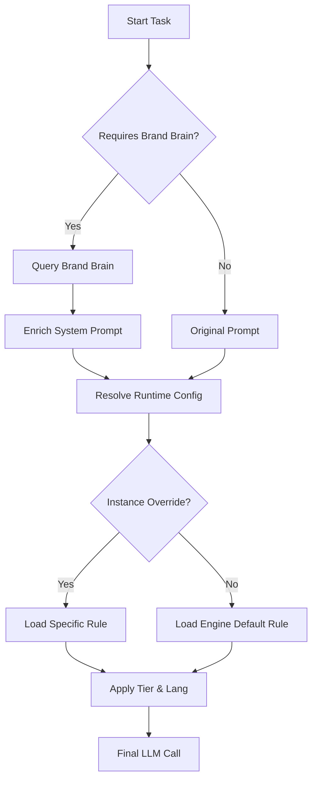

# PRD 8.0 - Phase 1 Summary: Sub-Agent v2 & Brand Brain

This document summarizes the changes implemented in Phase 1 of the PRD 8.0 roadmap. The focus was on refactoring the Sub-Agent schema, introducing a dynamic Runtime Resolver, and establishing the Brand Brain layer.

## 1. Sub-Agent Schema Refactoring (v2)

### SubAgentTemplateV2
The template schema was expanded to include metadata for dynamic resolution and Brand Brain integration.

*   **New Fields**:
    *   `engineTypeId`: Canonical engine type (e.g., 'planner', 'creator_text').
    *   `family`: Role family ('strategy', 'creation', 'conversation', 'governance', 'intelligence', 'memory').
    *   `roleTypeForRuntime`: Specific role for LLM context (e.g., 'strategist').
    *   `primaryLanguage`: Default language (e.g., 'ko').
    *   `preferredTier`: Default model tier ('creative', 'balanced', 'precise').
    *   `requiresBrandBrain`: Boolean.
    *   `brandContextMode`: 'light' | 'full' | 'none'.

### SubAgentInstance
Extended to support runtime overrides and channel bindings.

*   **New Fields**:
    *   `runtimeRuleOverrideId`: Optional ID to force a specific runtime rule.
    *   `channelBindings`: Array of channel IDs this instance manages.
    *   `brandBrainScope`: Scope of knowledge to access ('project', 'global').
    *   `metrics`: Expanded performance metrics (successRate, totalRuns).

## 2. Dynamic Runtime Resolution

Replaced the static "Runtime Profile" assignment with a dynamic resolver.

*   **Mechanism**: `utils-runtime-resolver.js`
*   **Logic**:
    1.  Check `SubAgentInstance.runtimeRuleOverrideId`.
    2.  If none, find `RuntimeProfileRule` matching `SubAgentTemplate.engineTypeId`.
    3.  Select model config based on `preferredTier`.
    4.  Apply `primaryLanguage` overrides from the Rule.
    5.  Merge with `SubAgentTemplate.config` (temp/tokens).

## 3. Brand Brain Layer

Introduced a centralized knowledge base entity.

*   **Schema**: `BrandBrain` (Firestore)
    *   `sources`: URLs, files, etc.
    *   `vectorStoreConfig`: Pinecone/Weaviate settings.
*   **Integration**: `utils-brand-brain.js`
    *   `queryBrandBrain()`: Retrieves context based on task prompt.
    *   `enrichSystemPromptWithBrandContext()`: Injects context into the system prompt.

## 4. Execution Flow (Summary)

## 5. Verification Checklist

- [x] **Schema**: `SubAgentTemplate` and `SubAgentInstance` updated in docs and code.
- [x] **Admin UI**: New fields (Family, Tier, Brand Brain) visible and editable.
- [x] **Resolver**: `resolveRuntimeConfig` correctly handles tiers, languages, and overrides.
- [x] **Brand Brain**: Mock utility returns context and enriches prompts.
- [x] **Backward Compatibility**: Legacy fields (`role_type`, `runtime_profile_id`) mapped or preserved.

## Next Steps (Phase 2)
- Implement **Channel Orchestrator v2**.
- Introduce **WorkflowTemplate** schema.
- Build the **Workflow Engine** to execute templates.
