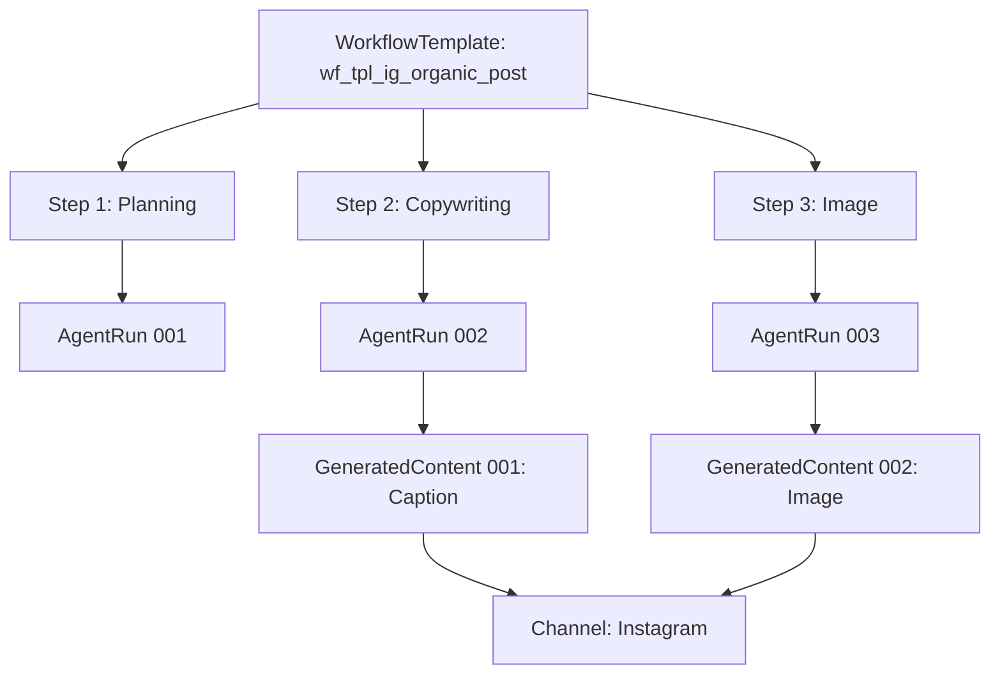

# Workflow Run Linking Example

This document illustrates how `WorkflowTemplate` execution links to `agentRuns` and `generatedContents` through the new linking fields.

## Scenario: Instagram Organic Post Workflow

### 1. Workflow Template Definition

```json
{
  "id": "wf_tpl_ig_organic_post",
  "name": "Instagram Organic Post",
  "description": "Standard workflow for creating an Instagram post",
  "steps": [
    {
      "id": "step_001_planning",
      "engineType": "planner",
      "roleType": "strategist",
      "action": "Generate post concept and hashtags"
    },
    {
      "id": "step_002_copywriting",
      "engineType": "creator_text",
      "roleType": "creator",
      "action": "Write engaging caption"
    },
    {
      "id": "step_003_image_generation",
      "engineType": "creator_image",
      "roleType": "creator",
      "action": "Generate visual content"
    },
    {
      "id": "step_004_compliance",
      "engineType": "compliance",
      "roleType": "moderator",
      "action": "Review for brand safety"
    },
    {
      "id": "step_005_approval",
      "engineType": "manager",
      "roleType": "strategist",
      "action": "Final approval"
    }
  ]
}
```

### 2. Execution Flow

When the Orchestrator executes this workflow:

1. **Step 1 (Planning)** → Creates `agentRun_001`
   - `workflowTemplateId`: `wf_tpl_ig_organic_post`
   - `workflowStepId`: `step_001_planning`
   - `teamInstanceId`: `team_abc123`
   - Output: Post concept JSON

2. **Step 2 (Copywriting)** → Creates `agentRun_002` + `generatedContent_001`
   - AgentRun:
     - `workflowTemplateId`: `wf_tpl_ig_organic_post`
     - `workflowStepId`: `step_002_copywriting`
     - `teamInstanceId`: `team_abc123`
   - GeneratedContent:
     - `workflowTemplateId`: `wf_tpl_ig_organic_post`
     - `workflowStepId`: `step_002_copywriting`
     - `teamInstanceId`: `team_abc123`
     - `channelId`: `ch_instagram_main`
     - `content_type`: `text`
     - `content_body`: "Check out our latest AI innovation! 🚀 #AI #Innovation"

3. **Step 3 (Image)** → Creates `agentRun_003` + `generatedContent_002`
   - Similar linking structure
   - `content_type`: `image`

4. **Step 4 (Compliance)** → Creates `agentRun_004`
   - Reviews previous content
   - No new content generated

5. **Step 5 (Approval)** → Creates `agentRun_005`
   - Final decision
   - Updates `generatedContent_001` and `generatedContent_002` status to `approved`

### 3. Data Relationships



### 4. Query Examples

**Find all runs for a specific workflow:**
```javascript
db.collection('projects').doc(projectId)
  .collection('agentRuns')
  .where('workflowTemplateId', '==', 'wf_tpl_ig_organic_post')
  .get();
```

**Find all content generated by a specific workflow step:**
```javascript
db.collection('projects').doc(projectId)
  .collection('generatedContents')
  .where('workflowTemplateId', '==', 'wf_tpl_ig_organic_post')
  .where('workflowStepId', '==', 'step_002_copywriting')
  .get();
```

**Find all content for a specific channel:**
```javascript
db.collection('projects').doc(projectId)
  .collection('generatedContents')
  .where('channelId', '==', 'ch_instagram_main')
  .get();
```

## Benefits

1. **Traceability**: Track which workflow and step produced each piece of content.
2. **Analytics**: Measure workflow performance and step-level success rates.
3. **Debugging**: Identify bottlenecks or failures in specific workflow steps.
4. **Audit Trail**: Complete history of how content was created and approved.
